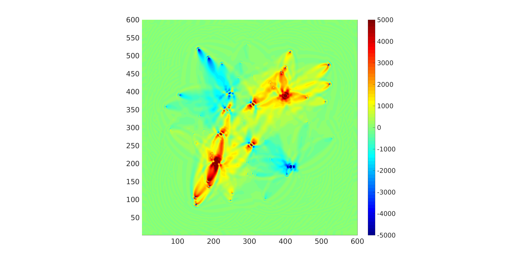

# cudaMedianFilter

An example for cuda median filter.

## License

[The MIT License](http://tchel.mit-license.org/)

## Anthor

Tche LIU, seistche@gmail.com, USTC

## Methodology

Firstly, there are two way to calculate the median of filtering window in the program, respectively corresponding to the two functions `medianBubble` and `medianNoSort` in the file _kernelMedianFilter.cu_. The former [Bubble] uses the incomplete bubble sorting method to find the meidan, while the latter [NoSort] does not sort the input array (To be honest, I do not know what the name of the latter algorithm is, and will be grateful to you if you tell me the answer).

Besides, according to __Boundary issues__ of [the page](https://en.wikipedia.org/wiki/Median_filter), there are three schemes to handle missing window entries at the boundaries:

- [Discard] Avoid processing the boundaries,
- [Shrink] Shrink the window near the boundaries,
- [Extend] Repeat the first value, as with the last value.

And I have another idea for this issues, that is:

- [Zero] Fill the parts beyond the boundaries of filtering window with zero.

Finally, due to  [JackOLantern](https://stackoverflow.com/users/1886641/jackolantern)'s answer and conclusion for [the question](https://stackoverflow.com/questions/19634328/2d-cuda-median-filter-optimization), "_the version __not using shared memory__ seems to be (slightly) convenient in all the cases_", the program replaces shared memory with register to store the filtering window.

## Compile

There are some different macros for these different methods, that is, for these different  functions in the file _kernelMedianFilter.cu_:

|    Macro    |      Function       |
| :---------: | :-----------------: |
| __Bubble__  |    medianBubble     |
| __NoSort__  |    medianNoSort     |
| __Discard__ | kernelFilterDiscard |
| __Extend__  | kernelFilterExtend  |
| __Shrink__  | kernelFilterShrink  |
|  __Zero__   |  kernelFilterZero   |

And for extendibility, the another macro __HSM__ is provided as half of filtering window length (FWL), i. e., $HSM = (FWL - 1)/2$.

We can arbitrarily combine Bubble/NoSort for the median calculation with Discard/Extend/Shrink/Zero for the boundary issue.

 For example, if we want to filter by the former way of the median calculation, by the first scheme of the boundary issue, and with a 9x9 window, the program can be compiled with:

```shell
nvcc Main.cu -DBubble -DDiscard -DHSM=4 -o filter
```

And note the setting $HSM=(9-1)/2=4$.

## Results

There are a $600 \times 600$ image matrix in the file _example/data_orig.bin_, after __matlab__ plotting with:

```matlab
fp = fopen('example/data_orig.bin', 'rb');
orig = fread(fp, [600, 600], 'single');
fclose(fp);

pcolor(orig);
set(gca, 'FontSize', 20);
shading interp;
caxis([-5000,5000]);
colormap jet;
axis image;
colorbar;
```

shown as follows:



As an example, the result of Bubble-Discard-HSM=4 for the data is:


and other results are listed below the folder _figures/_.

The elapsed times for different combinations are shown as follows:


And for clarity, the result based on the log time axis is as:


